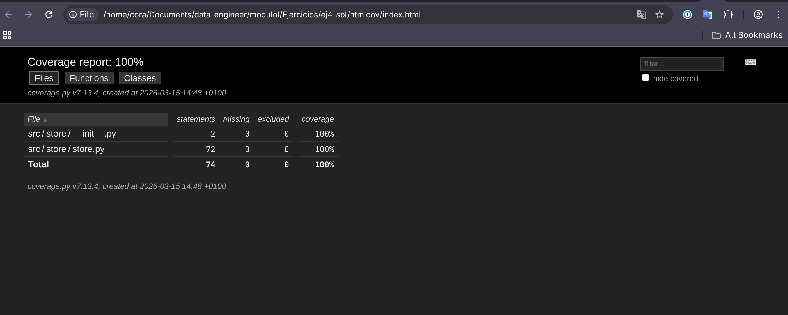
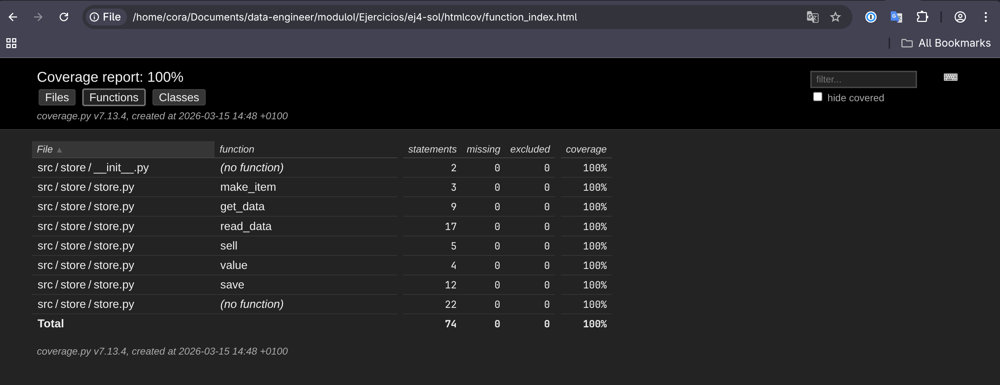

# Store package

Ejercicio del **Máster Big Data, & Data Engineering 2025-2026**, estructurar correctamente los ficheros para hacer un paquete instalable y conseguir una cobertura del **100%** en los tests.

## Cobertura

El paquete alcanza una cobertura del 100% en los tests.




## Instalación

### Desarollo

Para reproducir el ejemplo completo basta con clonar el repositorio y ejecutar `uv sync`. Con el entorno seteado podemos ejecutar los test e inspeccionar el informe de cobertura generado en `htmlcov/index.html`.

```bash
…/moduloI/Ejercicios ❯ git clone https://github.com/adecora/store-package
Cloning into 'store-package'...
remote: Enumerating objects: 26, done.
remote: Counting objects: 100% (26/26), done.
remote: Compressing objects: 100% (21/21), done.
remote: Total 26 (delta 2), reused 26 (delta 2), pack-reused 0 (from 0)
Receiving objects: 100% (26/26), 288.72 KiB | 2.37 MiB/s, done.
Resolving deltas: 100% (2/2), done.

…/moduloI/Ejercicios ❯ cd store-package/

store-package main ❯ uv sync
Using CPython 3.12.11
Creating virtual environment at: .venv
Resolved 10 packages in 1ms
Installed 8 packages in 24ms
 + coverage==7.13.4
 + iniconfig==2.3.0
 + packaging==26.0
 + pluggy==1.6.0
 + pygments==2.19.2
 + pytest==9.0.2
 + pytest-cov==7.0.0
 + pytest-datafiles==3.0.1

store-package main ❯ source .venv/bin/activate

store-package main ❯ pytest
========================================================== test session starts ==========================================================
platform linux -- Python 3.12.11, pytest-9.0.2, pluggy-1.6.0 -- /home/cora/Documents/data-engineer/moduloI/Ejercicios/store-package/.venv/bin/python
cachedir: .pytest_cache
rootdir: /home/cora/Documents/data-engineer/moduloI/Ejercicios/store-package
configfile: pyproject.toml
testpaths: tests
plugins: datafiles-3.0.1, cov-7.0.0
collected 9 items

tests/test_store.py::test_make_item1 PASSED                                                                                       [ 11%]
tests/test_store.py::test_make_item2[-5-100-001_AA-Tornillos con cabeza grande-12] PASSED                                         [ 22%]
tests/test_store.py::test_make_item2[25-0-001_AA-Tornillos con cabeza grande-12] PASSED                                           [ 33%]
tests/test_store.py::test_make_item2[25-100-001_AA-Tornillos con cabeza grande--12] PASSED                                        [ 44%]
tests/test_store.py::test_get_data PASSED                                                                                         [ 55%]
tests/test_store.py::test_read_data PASSED                                                                                        [ 66%]
tests/test_store.py::test_sell1 PASSED                                                                                            [ 77%]
tests/test_store.py::test_value PASSED                                                                                            [ 88%]
tests/test_store.py::test_save1 PASSED                                                                                            [100%]

============================================================ tests coverage =============================================================
___________________________________________ coverage: platform linux, python 3.12.11-final-0 ____________________________________________

Coverage HTML written to dir htmlcov
=========================================================== 9 passed in 0.08s ===========================================================

store-package main  ❯ open htmlcov/index.html
```

### Producción

```bash
…/moduloI/Ejercicios ❯ mkdir test

…/moduloI/Ejercicios ❯ cd test

…/Ejercicios/test ❯ uv venv
Using CPython 3.12.11
Creating virtual environment at: .venv
Activate with: source .venv/bin/activate

…/Ejercicios/test ❯ uv pip install "git+https://github.com/adecora/store-package"
Resolved 7 packages in 323ms
Installed 7 packages in 15ms
 + iniconfig==2.3.0
 + packaging==26.0
 + pluggy==1.6.0
 + pygments==2.19.2
 + pytest==9.0.2
 + pytest-datafiles==3.0.1
 + store-package==0.0.1 (from git+https://github.com/adecora/store-package@98c5a2542167863d6c21e4be350c31479d03b528)

…/Ejercicios/test ❯ source .venv/bin/activate

…/Ejercicios/test ❯ python
Python 3.12.11 (main, Aug  6 2025, 22:58:09) [Clang 20.1.4 ] on linux
Type "help", "copyright", "credits" or "license" for more information.
>>> import store
>>> store.read_data()
{'products': {'F01': {'cmin': 25, 'cmax': 100, 'place': '001_AA', 'description': 'Tornillos con cabeza grande', 'price': 321}, 'F02': {'cmin': 2, 'cmax': 10, 'place': '001_AB', 'description': 'Alicates grandes', 'price': 1235}, 'F03': {'cmin': 20, 'cmax': 80, 'place': '021_CA', 'description': 'Arandelas delgadas para tornillos de debeza grande', 'price': 381}, 'F04': {'cmin': 5, 'cmax': 30, 'place': '031_ZA', 'description': 'Alcayatas planas en paquetes de 25', 'price': 490}, 'F05': {'cmin': 200, 'cmax': 1000, 'place': '061_ZU', 'description': 'caja de chinchetas', 'price': 210}, 'F06': {'cmin': 25, 'cmax': 100, 'place': '034_CA', 'description': 'martillo de mediano', 'price': 1630}}, 'stock': {'F01': 70, 'F02': 3, 'F03': 35, 'F04': 27, 'F05': 458, 'F06': 45}, 'anomalies': {'F04', 'F02'}, 'restock': {'F04', 'F03'}}
>>> ^D

…/Ejercicios/test ❯ cat << EOF > test.py
∙ from store import read_data
∙
∙ print(read_data())
∙ EOF

…/Ejercicios/test ❯ python test.py
{'products': {'F01': {'cmin': 25, 'cmax': 100, 'place': '001_AA', 'description': 'Tornillos con cabeza grande', 'price': 321}, 'F02': {'cmin': 2, 'cmax': 10, 'place': '001_AB', 'description': 'Alicates grandes', 'price': 1235}, 'F03': {'cmin': 20, 'cmax': 80, 'place': '021_CA', 'description': 'Arandelas delgadas para tornillos de debeza grande', 'price': 381}, 'F04': {'cmin': 5, 'cmax': 30, 'place': '031_ZA', 'description': 'Alcayatas planas en paquetes de 25', 'price': 490}, 'F05': {'cmin': 200, 'cmax': 1000, 'place': '061_ZU', 'description': 'caja de chinchetas', 'price': 210}, 'F06': {'cmin': 25, 'cmax': 100, 'place': '034_CA', 'description': 'martillo de mediano', 'price': 1630}}, 'stock': {'F01': 70, 'F02': 3, 'F03': 35, 'F04': 27, 'F05': 458, 'F06': 45}, 'anomalies': {'F04', 'F02'}, 'restock': {'F04', 'F03'}}
```

## Consideraciones
- Se usa [uv](https://docs.astral.sh/uv/) como gestor de paquetes.
- Uso de los apuntes de clase y las recomendaciones de [packaging de python](https://packaging.python.org/en/latest/tutorials/packaging-projects/) y [setuptools](https://setuptools.pypa.io/en/latest/userguide/datafiles.html#include-package-data) para el empaquetado.
- Se sigue la estructura recomendada guía de packaging de python:
  ```bash
  packaging_tutorial/
  └── src/
      └── example_package_YOUR_USERNAME_HERE/
          ├── __init__.py
          └── example.py
  ```
- Sólo se distribuye **store.txt** con el paquete **store**, los ficheros: **store1.txt**, **store2.txt** sólo se usan para tests, se incluyen en un directorio `tests/test_files`.
- `pytest`:
  * Archivos temporales en [pytest](https://docs.pytest.org/en/stable/how-to/tmp_path.html).
  * Ejemplos de [pytest-datafiles](https://github.com/omarkohl/pytest-datafiles/blob/main/examples/example_3.py).
- Configuración de settings en vscode:
  * https://github.com/ArjanCodes/examples/blob/main/2024/vscode_python/.vscode/settings.json
  * https://github.com/CoreyMSchafer/dotfiles/blob/master/settings/VSCode-Settings.json
- Para comprobar que el directorio `data` se distribuye correctamente con el paquete, podemos inspeccionar el fichero **wheel** que no es más que un fichero **zip** con más información de metadata:
  ```bash
  ej4-sol main  ❯ uv build
  Building source distribution...
  ...
  Successfully built dist/store_package-0.0.1.tar.gz
  Successfully built dist/store_package-0.0.1-py3-none-any.whl

  ej4-sol main  ❯ unzip -l dist/store_package-0.0.1-py3-none-any.whl
  Archive:  dist/store_package-0.0.1-py3-none-any.whl
    Length      Date    Time    Name
  ---------  ---------- -----   ----
        209  2026-03-15 14:18   store/__init__.py
      4939  2026-03-15 14:18   store/store.py
        441  2026-03-15 14:18   store/data/store.txt
      6001  2026-03-15 14:18   store_package-0.0.1.dist-info/METADATA
        91  2026-03-15 14:18   store_package-0.0.1.dist-info/WHEEL
          6  2026-03-15 14:18   store_package-0.0.1.dist-info/top_level.txt
        541  2026-03-15 14:18   store_package-0.0.1.dist-info/RECORD
  ---------                     -------
      12228                     7 files
  ```

## Estructura

La estructura final del paquete **store** es la siguiente:

```bash
.
├── assets
│   ├── cobertura1.jpg
│   └── cobertura2.jpg
├── dist
│   ├── store_package-0.0.1-py3-none-any.whl
│   └── store_package-0.0.1.tar.gz
├── enunciado.md
├── pyproject.toml
├── README.md
├── src
│   ├── store
│   │   ├── __init__.py
│   │   ├── __pycache__
│   │   │   ├── __init__.cpython-312.pyc
│   │   │   └── store.cpython-312.pyc
│   │   ├── data
│   │   │   └── store.txt
│   │   └── store.py
│   └── store_package.egg-info
│       ├── dependency_links.txt
│       ├── PKG-INFO
│       ├── requires.txt
│       ├── SOURCES.txt
│       └── top_level.txt
├── tests
│   ├── __pycache__
│   │   └── test_store.cpython-312-pytest-9.0.2.pyc
│   ├── test_files
│   │   ├── store1.txt
│   │   └── store2.txt
│   └── test_store.py
└── uv.lock
```

---
[@title]: #
[Source - https://stackoverflow.com/a/35760941]: #
[Posted by Harmon, modified by community. See post 'Timeline' for change history]: #
[Retrieved 2026-02-26, License - CC BY-SA 4.0]: #

<style>
    footer {
    width: 100%;
    display: flex;
    justify-content: center;
    margin: 3rem 0;

    & a svg {
      position: relative;
      top: 4px;
      height: 1.25em;
    }
  }
</style>
<footer>
    <a href="https://alejandrodecora.es/til">
        Hecho con 💜 por
        <!-- prettier-ignore -->
        <svg viewBox="0 0 600 530" version="1.1" xmlns="http://www.w3.org/2000/svg">
        <path
          d="m135.72 44.03c66.496 49.921 138.02 151.14 164.28 205.46 26.262-54.316 97.782-155.54 164.28-205.46 47.98-36.021 125.72-63.892 125.72 24.795 0 17.712-10.155 148.79-16.111 170.07-20.703 73.984-96.144 92.854-163.25 81.433 117.3 19.964 147.14 86.092 82.697 152.22-122.39 125.59-175.91-31.511-189.63-71.766-2.514-7.3797-3.6904-10.832-3.7077-7.8964-0.0174-2.9357-1.1937 0.51669-3.7077 7.8964-13.714 40.255-67.233 197.36-189.63 71.766-64.444-66.128-34.605-132.26 82.697-152.22-67.108 11.421-142.55-7.4491-163.25-81.433-5.9562-21.282-16.111-152.36-16.111-170.07 0-88.687 77.742-60.816 125.72-24.795z"
          fill="#1185fe" />
        </svg>
        <code>@vichelocrego</code>
    </a>
</footer>